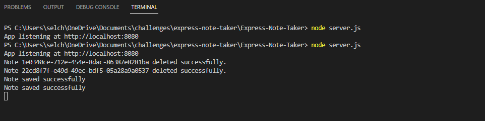

# Express-Note-Taker

## Challenge Description
For this challenge, the Express.js framework has been used to create a server-side API. This application allows users to write, view and delete notes. Both GET and POST requests have been used to view and submit information to the server when the endpoints are visited.
Express.js, fs, path and uuid modules have been used to handle the application.


## Installation Process
* To run this application locally, clone this repository and open in a text editor. You will need to access CLI and install the required packages as part of Node.js. Invoke the server.js file in the terminal and navigate to "localhost:8080" to launch the application. 

* This application is also hosted on <a>Heroku</a>


## Acceptance Criteria
```
GIVEN a note-taking application
WHEN I open the Note Taker
THEN I am presented with a landing page with a link to a notes page
WHEN I click on the link to the notes page
THEN I am presented with a page with existing notes listed in the left-hand column, plus empty fields to enter a new note title and the note’s text in the right-hand column
WHEN I enter a new note title and the note’s text
THEN a Save icon appears in the navigation at the top of the page
WHEN I click on the Save icon
THEN the new note I have entered is saved and appears in the left-hand column with the other existing notes
WHEN I click on an existing note in the list in the left-hand column
THEN that note appears in the right-hand column
WHEN I click on the Write icon in the navigation at the top of the page
THEN I am presented with empty fields to enter a new note title and the note’s text in the right-hand column
```
# Demo screenshots:
## Home Page


## Notes Page


## Console Log in Terminal


## Demo walkthrough

.gif)


## Link to GitHub Repository
https://github.com/Saria995/Express-Note-Taker.git

## Heroku Page
https://saria-express-note-taker.herokuapp.com/ 